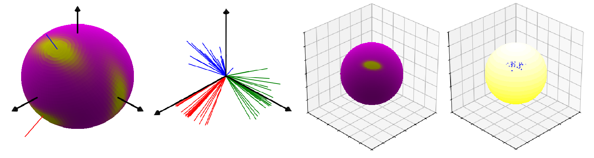

# rotstats: a Python library for probability distributions of orientational data



This package includes several models for probability distributions of orientational data. Orientational data here refers to any type of data that defines the orientation of a rigid body with respect to an inertial coordinate system. These orientations can be achieved by 1-DOF rotations (rotations about a fixed axis, data is in $S^1$), 2-DOF rotations (elevation and azimuth, data is in $S^2$), or full 3-DOF rotations (data is in $S^3$ or SO(3), i.e. quaternions or rotation matrices).

This package offers functions for models for data in $S^2$, $S^3$ (with and without antipodal symmetry) and SO(3). Hance the data can be unit vectors, quaternions or rotation matrices.

For each model, functions for density, simulation (sampling), and fitting to data are included. In addition, functions for visualisation of distributions in both $S^2$ and SO(3) are offered.

Currently, the following models are included:

- **Angular Central Gaussian distribution (ACG)**. Supports $S^{d-1}$ with antipodal symmetry. Ideal for quaternions (d=4).
- **Matrix Fisher distribution**. Supports SO(3). Ideal for rotation matrices.
- **Bingham distribution**. Currently only $S^3$ with antipodal symmetry is supported, i.e. for quaternions.
- **Elliptically Symmetric Angular Gaussian distribution (ESAG)**. Currently only $S^2$ is supported, i.e. for unit vectors in $R^3$. 
- **Gaussian in the tangent space of** $S^{d-1}$. Simple Gaussian defined in the tangent space. Works for any $S^{d-1}$ with or without antipodal symmetry.

For detailed theoretical information, see the paper [A cheatsheet for probability distributions of orientational data](https://arxiv.org/abs/2412.08934) which this package accompanies.

## Installation

Clone this repo and install from its root directory.

```
git clone https://github.com/PabloLopezCustodio/rotation-statistics.git
cd rotation-statistics
pip install -e .
```

Python 3 is required. The package was tested on Python 3.12.

## Usage

Each model has a class. To define a distribution an object of the corresponding class can be initialised in different ways depending on the model's parameters, see the [accompanying paper](https://arxiv.org/abs/2412.08934) for more information.
- `ACG(Lambda)`: `Lambda` is the concentration matrix $\Lambda$, an SPD($d$) matrix.
- `M_Fisher(F=F)` or `M_Fisher(U=U,V=V,s=s)`: `F` is the concentration matrix ($R^{3\times 3}$) while `U`, `V`, `s` correspond to its SVD, i.e. $F=USV^T$, with `s` containing the diagonal elements of $S$.
- `Bingham(B)`: `B` is the concentration matrix, an SPD($d$) matrix.
- `ESAG(mu=mu, gamma=gamma)` or `ESAG(mu=mu, rho=rho, psi=psi)`: `mu` is the parameter $\mu\in R^3$. `gamma` is the parameter vector $(\gamma_1, \gamma_2)\in R^2$. `rho` and `psi` provide the geometric parametrisation with $\rho$ being the concentration parameter and $\psi$ the rotation of principal axes.
- `TS_Gaussian(Sigma, b, Tb, antipodal_sym)`: `b` is the base point, i.e. the mean $b\in S^{d-1}$; `Tb` is a $R^{d\times(d-1)}$ matrix whose columns are the principal axes of the Gaussian. Hence, $[b$ $T_b]$ is in SO($d$) and the covariance matrix `Sigma` is diagonal. Set `antipodal_sym` to `True` (default) to force antipodal symmetry in the distribution.

The available functions are presented here for the case of the ACG distribution. For the other models, replace `ACG` for:
- `MFisher` for Matrix Fisher.
- `ESAG` for ESAG.
- `bingham` for Bingham.
- `TSG` for the Gaussian in the tangent space.

Member functions of the `ACG` class:
- `r_ACG(n)`: draws `n` samples from the distribution.
- `d_ACG(x)`: density at `x`, which is in $S^{d-1}$.
- `view_ACG(n_points=100, combine=True, hold_show=False, el=30, az=45, renorm_den=None, title="ACG density map")`: generates a visualisation of the ditribution. If $d=3$, this is a density map on the sphere $S^2$, if $d=4$ the map shows the density of frames, see Section 2.4 of the [accompanying paper](https://arxiv.org/abs/2412.08934). Parameters:
    * `n_points`: number of points to build the mesh. The total number of points in the mesh is `2*int(n_points/2)**2`.
    * `combine`: in the case of quaternions and rotation matrices, combine the density maps of the three axes of the frame in one single plot (see [Sec. 1.4](https://arxiv.org/abs/2412.08934)).
    * `hold_show`: if `True`, the command `plt.show()` is not executed, allowing to display other plots at the same time (Useful to compare different models, distributions or data).
    * `el` and `az`: elevation and azimuth of the view.
    * `renorm_den`: renormalise the density by this factor of the maximum density, e.g. to make the colormap take values in (0,1] `renorm_den=1.0`. 
    * `title`: Plot title. 

Non-member functions:
- `fit_ACG(axial_data)`: fits an ACG distribution to the data in `axial_data`, which has shape `(n, d)` where `n` is the number of points in the dataset and `d` is the dimension of the ambient space.

## Examples

The following scripts are provided as examples. Each script defines a distribution, draws samples from it, then fits another distribution to it to recover the original parameters.

- `test_acg_S2.py` and `test_acg_S3.py`: uses the ACG distribution for $S^2$ and $S^3$, respectively. 
- `test_bingham_S3.py`: uses the Bingham distribution for $S^3$. 
- `test_esag_S2.py`: uses the ESAG distribution for $S^2$.
- `test_mat_fisher.py`: uses the Matrix Fisher distribution for SO(3).
- `test_tsg_S2.py` and `test_tsg_S3.py`: uses the Gaussian in the tangent space for $S^2$ and $S^3$, respectively.

The following scripts analyse the data from the experiments presented in Section 7 of the [paper](https://arxiv.org/abs/2412.08934).

- `experiment_mustard.py`: experiment in Section 7.1.
- `experiment_aruco.py`: experiment in Section 7.2.

## To Do

- Make sure the Bingham implementation works for $S^2$.
- For Bingham, either improve interpolation in the lookup table to compute the normalising constant and MLE, or change implementation to use the Cython integrands from the Matrix-Fisher distribution.


